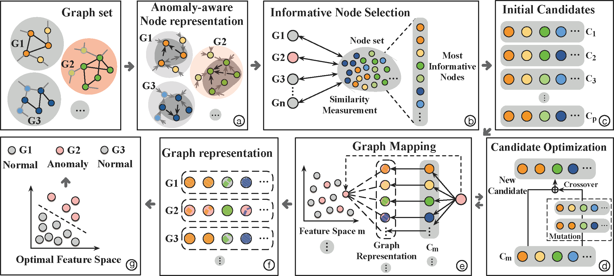

  
   

<h1> Towards Graph-level anomaly detection via deep evolutionary mapping </h1>

Open-sourced implementation for GmapAD - KDD 2023.

GmapAD is a graph-level anomaly detection framework with specially designed explainable graph mapping that maps graphs into a latent space where anomalies can be effectively detected. GmapAD's framework is shown as above.

<h2> Python Dependencies </h2>

Our proposed GmapAD framework is implemented in Python 3.7 and major libraries include: 

* [Pytorch](https://pytorch.org/) = 1.11.0+cu102
* [PyG] (https://pytorch-geometric.readthedocs.io/en/latest/) torch-geometric=2.1.0

More dependencies are provided in requirements.txt.

<h2> To Run </h2>

`python src/main.py`

<h2> Datasets </h2>

All datasets used in this paper are from previous works and the brain network datasets can be downloaded from [BrainNetDatasets](https://github.com/GRAND-Lab/graph\_datasets) and graph classification datasets can be downloaded from [GraphClsDatasets](https://chrsmrrs.github.io/datasets/).

<h2> Baselines </h2>

As provided in the Appendix of our manuscript, all baselines and their URLs are:

[WWL](https://github.com/BorgwardtLab/WWL) (https://github.com/BorgwardtLab/WWL).

[g-U-Nets](https://github.com/HongyangGao/Graph-U-Nets) (https://github.com/HongyangGao/Graph-U-Nets). 

[SAGPool](https://github.com/inyeoplee77/SAGPool) (https://github.com/inyeoplee77/SAGPool).

[DIFFPOOL](https://github.com/RexYing/diffpool) (https://github.com/RexYing/diffpool).

[GMT](https://github.com/JinheonBaek/GMT) (https://github.com/JinheonBaek/GMT).
    
[OCGIN](https://github.com/LingxiaoShawn/GLOD-Issues) (https://github.com/LingxiaoShawn/GLOD-Issues).

[OCGTL](https://github.com/boschresearch/GraphLevel-AnomalyDetection) (https://github.com/boschresearch/GraphLevel-AnomalyDetection).

[GLocalKD](https://github.com/RongrongMa/GLocalKD) (https://github.com/RongrongMa/GLocalKD).

[iGAD](https://github.com/graph-level-anomalies/iGAD/tree/main) (https://github.com/graph-level-anomalies/iGAD/tree/main).

